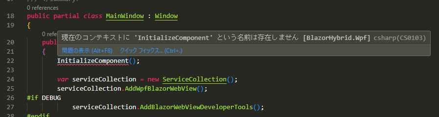

# トラブルシューティング

BlazorHybrid.Wpf



[[WPF] VSCode が WPF プロジェクトのエラーを表示します:「名前 'InitializeComponent' が現在のコンテキストに存在しません (Roslyn CS0103)」 #5958](https://github.com/dotnet/vscode-csharp/issues/5958)

[名前「InitializeComponent」は現在のコンテキスト (CS0103)、MainWindow.xaml.cs に存在しません。 #6863](https://github.com/dotnet/vscode-csharp/issues/6863)


Suppress RZ10012 analyser in blazor project

## `dotnet watch --project ./BlazorHybrid.Web` を実行すると警告 `warn: Microsoft.AspNetCore.DataProtection.KeyManagement.XmlKeyManager[XX] No XML encryptor configured. Key {XXXXX} may be persisted to storage in unencrypted form.` が表示される

```
$ dotnet watch --project ./BlazorHybrid.Web
dotnet watch 🔥 Hot reload enabled. For a list of supported edits, see https://aka.ms/dotnet/hot-reload.
  💡 Press "Ctrl + R" to restart.
dotnet watch 🔧 Building...
  Determining projects to restore...
  All projects are up-to-date for restore.
  BlazorHybrid.View -> /dotnet_BlazorHybrid2/BlazorHybrid.View/bin/Debug/net8.0/BlazorHybrid.View.dll
  BlazorHybrid.Web -> /dotnet_BlazorHybrid2/BlazorHybrid.Web/bin/Debug/net8.0/BlazorHybrid.Web.dll
dotnet watch 🚀 Started
warn: Microsoft.AspNetCore.DataProtection.KeyManagement.XmlKeyManager[35]
      No XML encryptor configured. Key {b906ca46-7115-4df6-b906-82b5fcb9859e} may be persisted to storage in unencrypted form.
info: Microsoft.Hosting.Lifetime[14]
      Now listening on: http://localhost:5080
dotnet watch 🌐 Unable to launch the browser. Navigate to http://localhost:5080
info: Microsoft.Hosting.Lifetime[0]
      Application started. Press Ctrl+C to shut down.
info: Microsoft.Hosting.Lifetime[0]
      Hosting environment: Development
info: Microsoft.Hosting.Lifetime[0]
      Content root path: /dotnet_BlazorHybrid2/BlazorHybrid.Web
warn: Microsoft.AspNetCore.HttpsPolicy.HttpsRedirectionMiddleware[3]
      Failed to determine the https port for redirect.
fail: Microsoft.AspNetCore.Antiforgery.DefaultAntiforgery[7]
      An exception was thrown while deserializing the token.
      Microsoft.AspNetCore.Antiforgery.AntiforgeryValidationException: The antiforgery token could not be decrypted.
       ---> System.Security.Cryptography.CryptographicException: The key {a0d77a2e-624c-4e8e-88f2-2a84a050c368} was not found in the key ring. For more information go to https://aka.ms/aspnet/dataprotectionwarning
         at Microsoft.AspNetCore.DataProtection.KeyManagement.KeyRingBasedDataProtector.UnprotectCore(Byte[] protectedData, Boolean allowOperationsOnRevokedKeys, UnprotectStatus& status)
         at Microsoft.AspNetCore.DataProtection.KeyManagement.KeyRingBasedDataProtector.Unprotect(Byte[] protectedData)
         at Microsoft.AspNetCore.Antiforgery.DefaultAntiforgeryTokenSerializer.Deserialize(String serializedToken)
         --- End of inner exception stack trace ---
         at Microsoft.AspNetCore.Antiforgery.DefaultAntiforgeryTokenSerializer.Deserialize(String serializedToken)
         at Microsoft.AspNetCore.Antiforgery.DefaultAntiforgery.GetCookieTokenDoesNotThrow(HttpContext httpContext)
```

## `dotnet watch --project ./BlazorHybrid.Web` を実行すると失敗 `fail: Microsoft.AspNetCore.Antiforgery.DefaultAntiforgery[XX] An exception was thrown while deserializing the token.` が表示される

## `warn: Microsoft.AspNetCore.HttpsPolicy.HttpsRedirectionMiddleware[XX] Failed to determine the https port for redirect.`

```
$ dotnet watch --project ./BlazorHybrid.Web
dotnet watch 🔥 Hot reload enabled. For a list of supported edits, see https://aka.ms/dotnet/hot-reload.
  💡 Press "Ctrl + R" to restart.
dotnet watch 🔧 Building...
  Determining projects to restore...
  All projects are up-to-date for restore.
  BlazorHybrid.View -> /dotnet_BlazorHybrid2/BlazorHybrid.View/bin/Debug/net8.0/BlazorHybrid.View.dll
  BlazorHybrid.Web -> /dotnet_BlazorHybrid2/BlazorHybrid.Web/bin/Debug/net8.0/BlazorHybrid.Web.dll
dotnet watch 🚀 Started
info: Microsoft.Hosting.Lifetime[14]
      Now listening on: http://localhost:5080
dotnet watch 🌐 Unable to launch the browser. Navigate to http://localhost:5080
info: Microsoft.Hosting.Lifetime[0]
      Application started. Press Ctrl+C to shut down.
info: Microsoft.Hosting.Lifetime[0]
      Hosting environment: Development
info: Microsoft.Hosting.Lifetime[0]
      Content root path: /dotnet_BlazorHybrid2/BlazorHybrid.Web
warn: Microsoft.AspNetCore.HttpsPolicy.HttpsRedirectionMiddleware[3]
      Failed to determine the https port for redirect.
```

### おすすめ拡張機能の機能をOFF
settings.json
```json
{
    "extensions.ignoreRecommendations": true
}
```


### Razor ファイルで、タグに予期しない名前の警告 Razor(RZ10012) が表示される
* 警告は表示されるがコンパイルは通り動作もする
* 警告が表示されるタグは一定ではなく、同じ環境でも変わる場合がある。また、警告が表示されないこともある

#### エラーメッセージ例
`Found markup element with unexpected name 'XXXXX'. If this is intended to be a component, add a @using directive for its namespace.Razor(RZ10012)`  
`予期しない名前「XXXXX」を持つマークアップ要素が見つかりました。これがコンポーネントであることを目的としている場合は、その名前空間に @using ディレクティブを追加します。Razor(RZ10012)`

[Suppress RZ10012 analyser in blazor project](https://stackoverflow.com/questions/73981342/suppress-rz10012-analyser-in-blazor-project)
blazor プロジェクトで RZ10012 アナライザーを抑制する
> これは既知のバグです (何年も前から遡ります)。このことは、SO や GitHub で何十回も報告されています。一貫して機能する修正や回避策はありません。
> エディター全体に波線が表示されている場合、生産性を高めることは不可能です。アプリ自体は動作するので、そのアナライザールールを抑制したいと思います。


#### イシュー
* 2024/4/21 時点でかなりのイシューが上がっている。数日前の投稿もありかなりホットな状態
* 

リンク
* [Extension stops indexing .razor (Blazor) component files after a certain number unless you open the file. #6921](https://github.com/dotnet/vscode-csharp/issues/6921)  
* [Error with project files not finding objects or razor tags #6852](https://github.com/dotnet/vscode-csharp/issues/6852)  
* [[BUG] Blazor Components are seen a unknown #49](https://github.com/microsoft/vscode-dotnettools/issues/49)  
* [Blazor components from same namespace not all recognized. #10275](https://github.com/dotnet/razor/issues/10275)  


### `Warning while loading /dotnet_BlazorHybrid2/BlazorHybrid.Web/BlazorHybrid.Web.csproj: Project file must include the .NET Framework assembly 'PresentationCore, PresentationFramework' in the reference list.` が表示される
```
Using dotnet configured on PATH
Dotnet path: /usr/share/dotnet/dotnet
Activating C# standalone...
waiting for named pipe information from server...
[stdout] {"pipeName":"/tmp/69755023.sock"}
received named pipe information from server
attempting to connect client to server...
client has connected to server
[Info  - 7:35:40 PM] [Program] Language server initialized
[Info  - 7:35:40 PM] [LanguageServerProjectSystem] /dotnet_BlazorHybrid2/BlazorHybrid.sln を読み込んでいます...
[Warn  - 7:35:44 PM] [LanguageServerProjectSystem] プロジェクト /dotnet_BlazorHybrid2/BlazorHybrid.Wpf/BlazorHybrid.Wpf.csproj に未解決の依存関係があります
[Info  - 7:35:46 PM] [LanguageServerProjectSystem] /dotnet_BlazorHybrid2/BlazorHybrid.Wpf/BlazorHybrid.Wpf.csproj の読み込みが正常に完了しました
[Info  - 7:35:46 PM] [LanguageServerProjectSystem] /dotnet_BlazorHybrid2/BlazorHybrid.View/BlazorHybrid.View.csproj の読み込みが正常に完了しました
[Warn  - 7:35:47 PM] [LanguageServerProjectSystem] Warning while loading /dotnet_BlazorHybrid2/BlazorHybrid.Web/BlazorHybrid.Web.csproj: Project file must include the .NET Framework assembly 'PresentationCore, PresentationFramework' in the reference list.
```